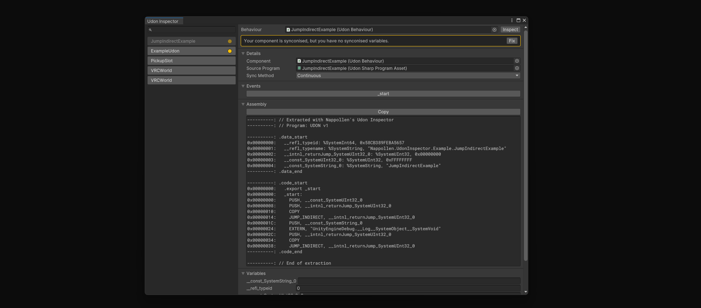

# Nappollen Udon Inspector

nappollen.udon-inspector




## Description

A Unity Editor extension that enhances the inspector for UdonBehaviour components, 
allowing developers to view Udon program source code directly within the Unity Editor. 
This tool improves the workflow for VRChat Udon developers by providing easy access to Udon scripts and their variables.
If you have only the ByteCode of the Udon program, you can use the Inspector to view the reversed source code, 
making it easier to understand and debug Udon scripts.

## Installation

### Via Package Manager

1. Open the Package Manager window
2. Click the "+" button and select "Add package from git URL..."
3. Enter: `https://github.com/nappollen/udon-inspector.git`

### Via manifest.json

Add the following line to your `Packages/manifest.json`:

```json
"nappollen.udon-inspector": "https://github.com/nappollen/udon-inspector.git"
```

## Usage

You can open the Udon Inspector by selecting **Nappollen > Udon Inspector** from the Unity Editor menu.  
You can extract all variables and UdonAssemblies from opened scenes by selecting the options in the **Tools > Udon Inspector** menu item.


## Requirements

- Unity 2022.3 or later

## License

See [LICENSE](LICENSE) file for details.

## Changelog

See [CHANGELOG](CHANGELOG.md) file for details.

---

<sub>This package was created with [Nappollen's Packager](https://github.com/nappollen/packager)</sub>
